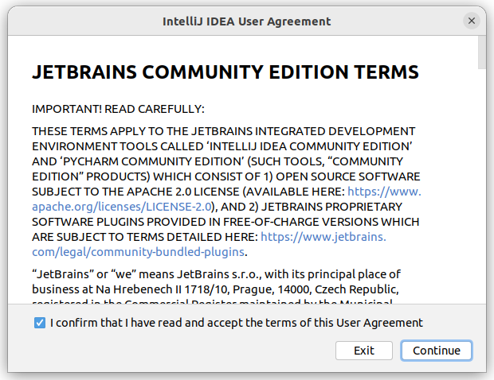
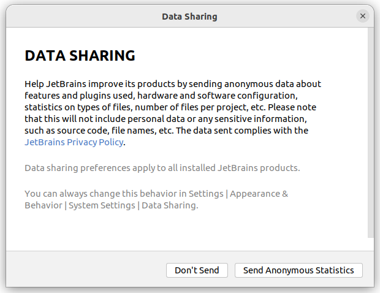

# IntelliJ IDEA

IntelliJ IDEA is an integrated development environment (IDE) used primarily for Java development. It's a powerful tool that offers a range of features to assist programmers in coding, debugging, and testing Java applications. The IDE provides a user-friendly interface and various productivity-boosting tools, aiding developers in their software development process.

## Clojure Support

IntelliJ IDEA is compatible with Clojure. It offers support for Clojure development through plugins. By installing the Clojure plugin in IntelliJ, developers can write, debug, and manage Clojure code within the IDE. The Clojure plugin provides features such as syntax highlighting, code completion, refactoring tools, and integration with the REPL (Read-Eval-Print Loop) for Clojure development.

## Install IntelliJ IDEA - Community Edition (Ubuntu)

Go to official website: https://www.jetbrains.com/idea/download/?section=linux

Download the Community Edition (free) version.


Go to the download folder and extract the file using `tar`
In my case, the folder is `~/Downloads/InteliJ`

```bash
cd ~/Downloads/InteliJ
tar -xzf ideaIC*.tar.gz
```

Go to the bin folder and run the `idea.sh` file

```bash
cd idea-IC-*/bin
./idea.sh
```

Follow the steps to install IntelliJ IDEA

1. Confirm terms and conditions and click on Continue



2. Select "Share anonymous statistics" if you want to share data with JetBrains or click on "Don't send" if you prefer to save your data.



3. Wait for the installation to finish and the IDE will open like this.

