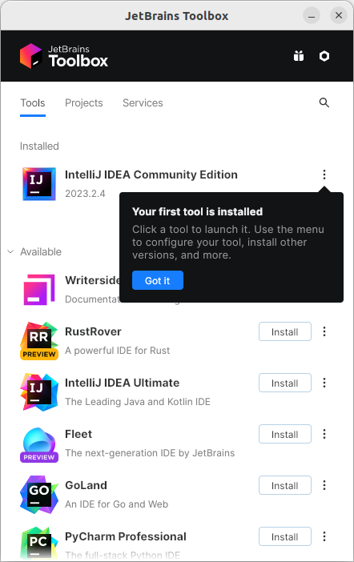

# JetBrains Toolbox

Is a platform developed by JetBrains to manage their various IDEs and developer tools. It's a centralized application that allows users to download, install, and manage different JetBrains products, including IntelliJ IDEA (used for Java development), PyCharm (for Python), WebStorm (for web development), and others.

The Toolbox application provides a convenient way to keep these tools up-to-date, manage versions, and configure settings for each individual JetBrains product. It also offers the ability to switch between different versions of the tools, making it easier for developers to work with the specific version they need for their projects. The Toolbox simplifies the management and accessibility of JetBrains' diverse range of programming tools from a single interface.

## Install JetBrains Toolbox (Ubuntu)

Go to official website: https://www.jetbrains.com/toolbox-app/

Download it's free.


Go to the download folder and extract the file using `tar`
In my case, the folder is `~/Downloads/InteliJ`

```bash
cd ~/Downloads/InteliJ
tar -xzf jetbrains-toolbox*.tar.gz
```

Go to the bin folder and run the `jetbrains-toolbox` file

```bash
cd jetbrains-toolbox*
./jetbrains-toolbox
```

Follow the steps to setup the Toolbox and you will see this screen.

